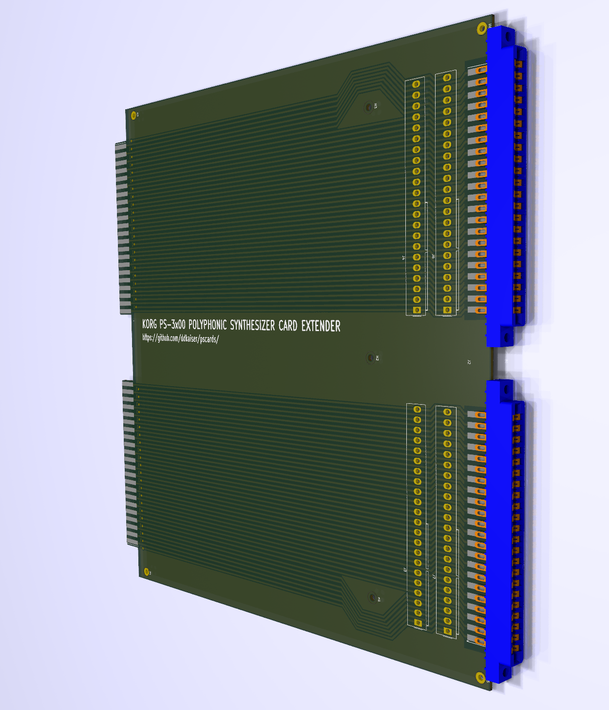

# pscards/card-extender

## Overview
KiCad project for creating a extender card. The extender card is useful for working on a Korg PS-Series Polyphonic Synthesizer.

The card is a pass-through board that extends a card outside the Korg synth chassis, to enable easier access while diagnosing and repairing

The extender card plugs-in to Korg synth backplane, and provides 2 44-pin card socket connections to host the Korg KLM board.

## Parts

### Card-Edge Sockets
Sockets can be:

-	[Sullins EBM22DREH](https://www.sullinscorp.com/product/?pn=EBM22DREH)
-	[EDAC 305-044-520-202](https://edac.net/series/305?search_part=305-044-520-202)
-	[Vector R644](https://www.vectorelect.com/connector-card-edge.html)
-	or similar card sockets.

### Test Points
The card provides header pads for adding test points. 

The test points are:
-	Molex 0.156” (3.96mm) header format, using vertical headers
-	[Molex KK396 part #0026481240](https://www.molex.com/en-us/products/part-detail/26481240)

### Card Dimensions
- Dimensioning of card assumes landscape orientation
- Height: 228mm  (including edge-connector).
- Width: 240mm
- Edge connector pads mirror card-edge traces, but there can be some variance in edge connector sizing & placing
	- Edge connectors can be between 87.5mm & 89mm in width and 10mm in height.
	- Edge connectors can be from 14mm to 15.5mm from outer (left/right) card edge.
	- Edge connectors can have a 32.5mm to 34mm gap between them.

